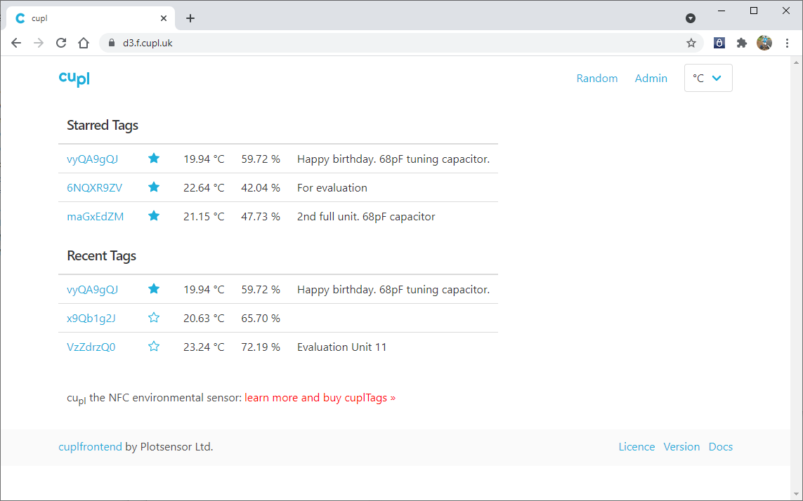

# cuplfrontend
This is the graphical user interface part of the cupl system. It is static web application written in [ReactJS](https://reactjs.org/). It displays samples collected from   [cuplTags](https://github.com/cuplsensor/cupltag) on a graph and in a table. There is a feature that allows tags to be *starred* and displayed on the home page. It wraps around all of the functionality in [cuplbackend](https://github.com/cuplsensor/cuplbackend).



## Installation

```
// Navigate to the app directory
cd reactapp

// Set the backend environment variable
export REACT_APP_WSB_ORIGIN=<your_backend_url_origin>

// Install all dependencies from packages.json:
npm install

// Start the ReactJS app
npm start
```

## Documentation

* cuplTag [Configuration with UART (2 of 2)](https://github.com/cuplsensor/cuplfrontend/blob/master/docs/guides/configUARTpt2/index.md).

## Licence

### Code

[](https://opensource.org/licenses/Apache-2.0)

### Documentation

[](https://creativecommons.org/licenses/by-sa/4.0/)
