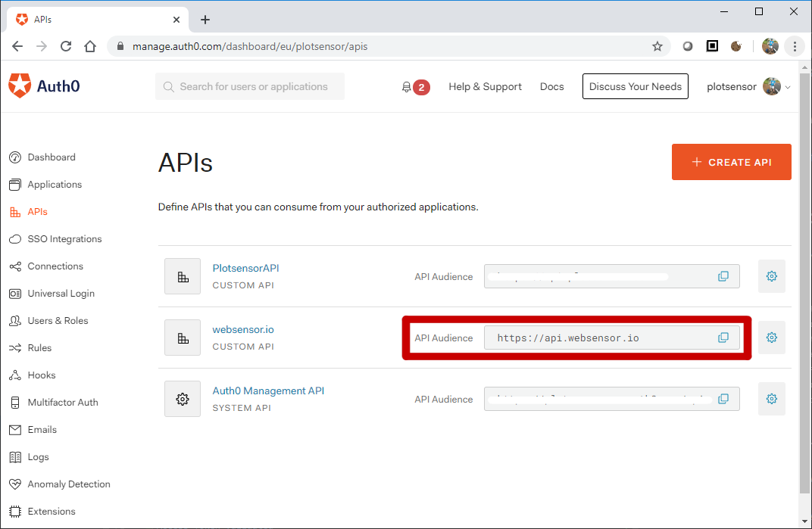
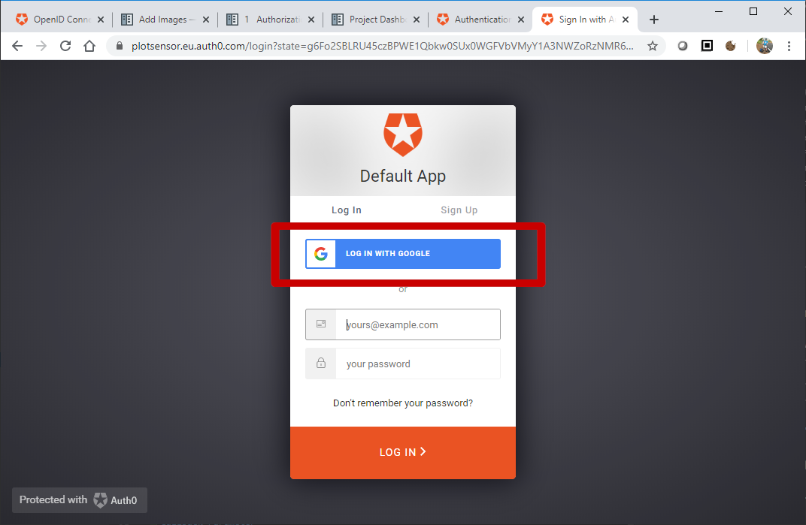

.. _authorization::

.. sectnum::

Authorization Grant Flow
===================================

User Clicks Sign In
----------------------
wsfrontend directs user to the ``/authorize`` endpoint on Auth0.com (`docs <https://auth0.com/docs/api/authentication#authorization-code-flow>`_)::

    callbackurl = url_for('dashboard.callback', _external=True)
    authorizeurl = "{AUTH0_URL}/authorize?" \
                   "response_type=code&" \
                   "client_id={AUTH0_CLIENTID}&" \
                   "redirect_uri={callbackurl}&" \
                   "scope=openid%20profile&" \
                   "audience={API_AUDIENCE}")
    return redirect(authorizeurl)

Audience Parameter
^^^^^^^^^^^^^^^^^^^^^
Request authorization for ``API_AUDIENCE`` (string).

I have set ``API_AUDIENCE = https://api.websensor.io``. The value itself is not significant. The URL does not need to be reachable.

The audience strings used by wsfrontend (for token request) and wsbackend (for token validation) **must** be equal.
It should also be the name of an API registered on Auth0.com.

Scope Parameter
^^^^^^^^^^^^^^^^^^^^^
Request authorization for scopes ``OpenID`` and ``Profile``. These are `OIDC scopes <https://auth0.com/docs/scopes/current/oidc-scopes>`_.
An access token with these scopes has permission to call the ``/userinfo``  API endpoint of the IdP. Auth0.com will
`respond <https://auth0.com/docs/api/authentication#get-user-info>`_ with basic user information such as a name and profile picture.

Scopes that grant permission for sensitive wsbackend endpoints may be defined in future.
A user with the ``administrator`` role will be granted scopes such as ``write:credits`` to be used with ``POST api/credits``. Ordinary users
will just be given a collection of ``read`` scopes.

.. _callback:

Callback Parameter
^^^^^^^^^^^^^^^^^^^^^
Auth0.com redirects back to this URL on wsfrontend when the authorization step is complete. If successful, Auth0.com appends an
authorization code under the ``code=`` parameter.

User Authenticates on Auth0.com
---------------------------------
Authentication happens when the user clicks the *log in with Google* button.

Auth0.com redirects back to the `<callback_>`_ URL.

Authorization Code is Exchanged for an Access Token
------------------------------------------------------
#. wsfrontend extracts authorization code from the callback URL.
#. wsfrontend sends code in a POST request to Auth0.com (`POST /oauth/token <https://auth0.com/docs/api/authentication#get-token>`_).
#. Auth0.com responds with an access token::

    HTTP/1.1 200 OK
    Content-Type: application/json
    {
      "access_token":"eyJz93a...k4laUWw",
      "token_type":"Bearer",
      "expires_in":86400
    }

