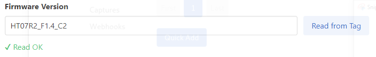

# Configure cuplTag with UART (Part 2 of 2)

The cuplfrontend web application is used to write configuration strings to a [cuplTag](https://github.com/cuplsensor/cupltag). Thanks to [WebSerial](https://www.chromestatus.com/feature/6577673212002304), there is no need to leave the browser.

## Equipment

You will need:

* A cuplTag PCBA connected to a PC as shown in [Part 1](https://github.com/cuplsensor/cupltag/blob/master/docs/guides/configUARTpt1/index.md).
* A cupl frontend + backend web application served with HTTPS ([instructions](https://github.com/cuplsensor/cupldeploy#installation)).
* The Chrome browser 89+ to use WebSerial.

## Provision a cuplTag

The first step is to add a new tag in the cupl web application. 

### Sign into the Web Application

1. Browse to the URL of [your instance](https://github.com/cuplsensor/cupldeploy#test-cuplfrontend) of cuplfrontend.
2. Select **Admin** in the top right.
3. Enter ``default_adminapi_clientid`` into the **client_id** field.
4. Enter ``LATEST_ADMINAPI_CLIENTSECRET`` (defined [here](https://github.com/cuplsensor/cupldeploy#define-github-secrets)) into the **client_secret** field.
5. Select **Log in**.

### Add a Tag 

When login is successful, you will be redirected to the tags page.

1. Select **Add** under Tags on the left-hand menu.
   
2. Select **Read from Tag** under Firmware Version *optional*
   1. In the serial port popup select MSP Application UART (or the USB-serial converter you are using). 
   2. On success you will see **Read OK.**
      
   3. You may need to read the tag twice for it to work (a bug). If there is no response to the read command, check the cuplTag is powered on and in programming mode (see part 1).
3. Enter the **Hardware Version** e.g. HT07R3 *optional*.
4. Enter a **Description** *optional*.
5. Select **Submit Query** at the bottom of the form. 

### Write Tag Configuration Strings over the Serial Port

1. A new tag is added to the database and you are redirected to the **serial configuration** page.
2. The **serial** string and **HMAC Secret Key** fields are generated by the application.
3. A list of configuration strings are displayed at the bottom of the screen. These update when the form is edited.
4. Change the tag format and sample interval to what you would like *optional*.
5. Select **Write to Tag** to write configuration strings over the serial port.
6. On success, you will see *Writing configuration strings* followed by *Write OK*.

   

## Test the Provisioned cuplTag

1. Remove the shorting jumper JP30, so the cuplTag will start up in normal mode on the next boot.
2. Press RESET.
3. Scan the cuplTag PCBA with a phone.
4. The cupl web application will open. Verify the serial string, temperature and humidity readings are as expected.

